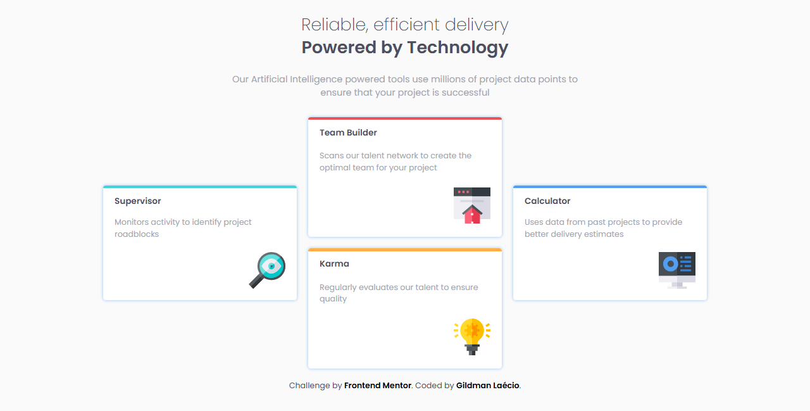
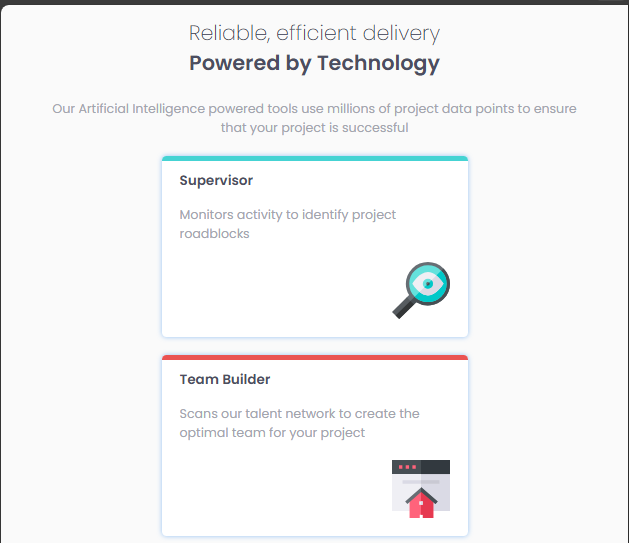
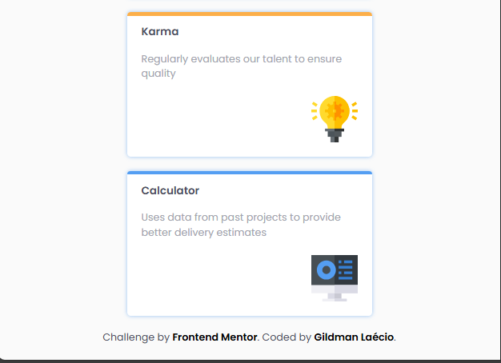

# four-card-feature-section-master
 Responsive Page

This is a solution to the [Four-card-feature-section-master challenge on Frontend Mentor](https://www.frontendmentor.io/learning-paths/building-responsive-layouts--z1qCXVqkD/steps/674c6af692fdd6803ca679de/challenge/start). Frontend Mentor challenges help you improve your coding skills by building realistic projects. 

## Table of contents

- [Overview](#overview)
  - [Screenshot](#screenshot)
  - [Links](#links)
- [My process](#my-process)
  - [Built with](#built-with)
  - [What I learned](#what-i-learned)
  - [Continued development](#continued-development)
- [Author](#author)

## Overview

### Screenshot

These are my screenshots showing how the project turned out.

- For desktop version:



- For mobile version:





### Links

- Solution URL: [My Solution](https://gillaercio.github.io/four-card-feature-section-master/)

## My process

### Built with

- Semantic HTML5 markup
- CSS custom properties
- Grid Layout
- Mobile-first workflow

### What I learned

I took advantage of this project to practice the use of **Grid Layout**:

Creating custom top bar

```css
.card {
  display: grid;
  width: 100%;
  max-width: 340px;
  position: relative;
}

.border:before {
  position: absolute;
  display: block;
  content: '';
  height: 5px;
  width: 100%;
  border-top-left-radius: 5px;
  border-top-right-radius: 5px;
}

.border-cyan:before {
  background-color: var(--Cyan);
}
```

### Continued development

I would like to improve the use of **Grid layout** in conjunction with media queries.

## Author

- Frontend Mentor - [@gillaercio](https://www.frontendmentor.io/profile/gillaercio)
- Github - [My Github](https://github.com/gillaercio)
- LinkedIn - [My LinkedIn](https://www.linkedin.com/in/gildman-la%C3%A9rcio/)